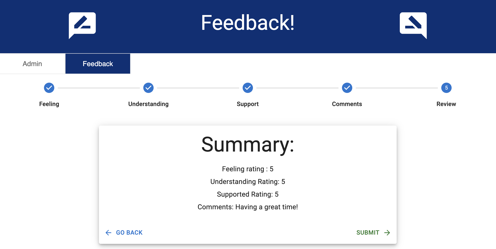

<!-- Badges -->

# React Feedback Loop

## Description

_Duration: Weekend Sprint_

A form separated into individual input to demonstrate using react redux. Also includes an admin page displaying the collected feedback.

[Deployed version of app](https://aqueous-waters-95713.herokuapp.com/#/)

[Link to APIdoc](https://venomidas.github.io/weekend-redux-feedback-loop/)

## Screenshot

### Prerequisites

- [Node.js](https://nodejs.org/en/)
- [nodemon](https://www.npmjs.com/package/nodemon)

## Installation

1. Create a database named `prime_feedback`,
2. The queries in the `database.sql` file are set up to create all the necessary tables and populate the needed data to allow the application to run correctly. The project is built on Postgres, so you will need to make sure to have that installed. I recommend using Postico to run those queries as that was used to create the queries,
3. Open your editor and run `npm install` in your terminal - this will install required dependencies.
2. run `npm run server` in your terminal. (Default port is 5000, if port is in use modify `server.js` port variable.)
3. run `npm run client` in a new terminal - this will launch the app in the browser.

## Usage

1. As a user I want to be able to rate how I'm feeling
2. As a user I want to be able to rate how well I'm understanding the content
3. As a user I want to be able to rate how well i'm being supported
4. As a user I want to be able to add comments
5. As an admin I want to be able to view all the feedback
6. As an admin I want to be able to delete feedback
7. as an admin I want to be able to mark feedback for review

## Built With

1. 
2. 
3. 
4. 
5. 
6. 
7. 
8. 
9. 
10. 
11. 
12. 
13. 
14. 
15. 
16. 

## License

[MIT](https://choosealicense.com/licenses/mit/)

## Acknowledgement

Thanks to [Prime Digital Academy](https://www.primeacademy.io/) and members of the Phrygian cohort who equipped and helped me to make this application a reality.

## Support

If you have suggestions or issues, please email me at [schuma1022@gmail.com](mailto:schuma1022@gmail.com)